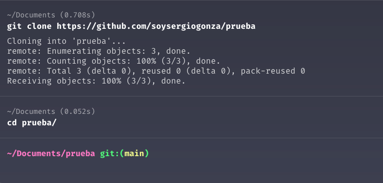
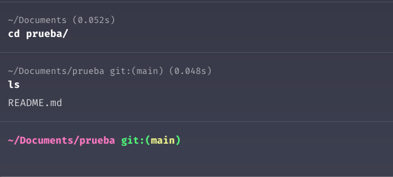
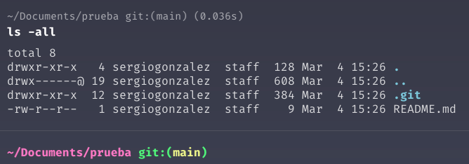
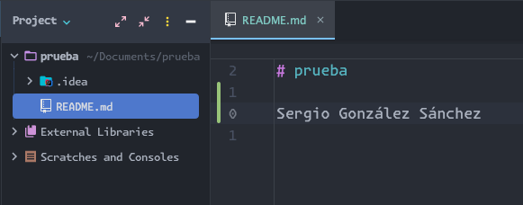
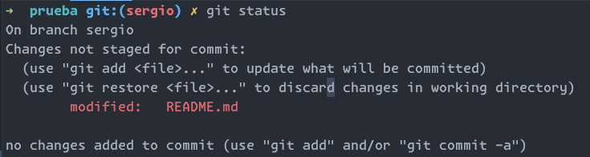
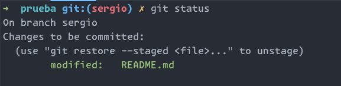
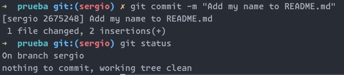
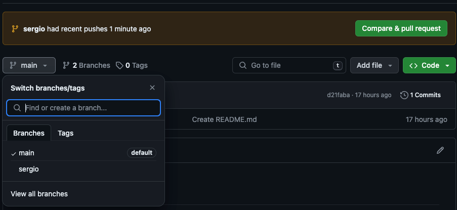
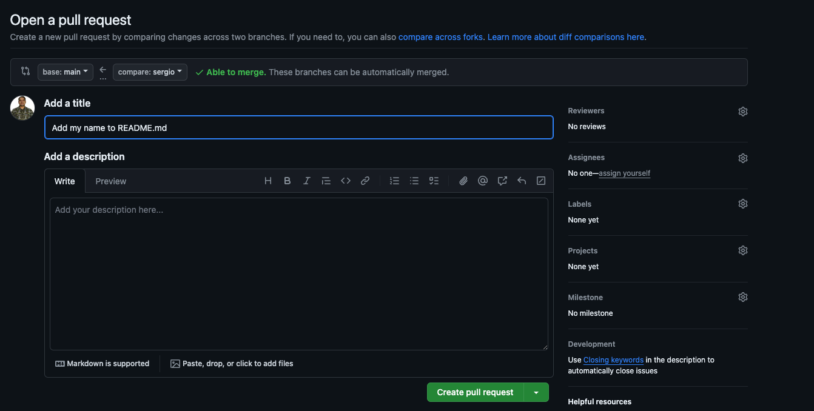
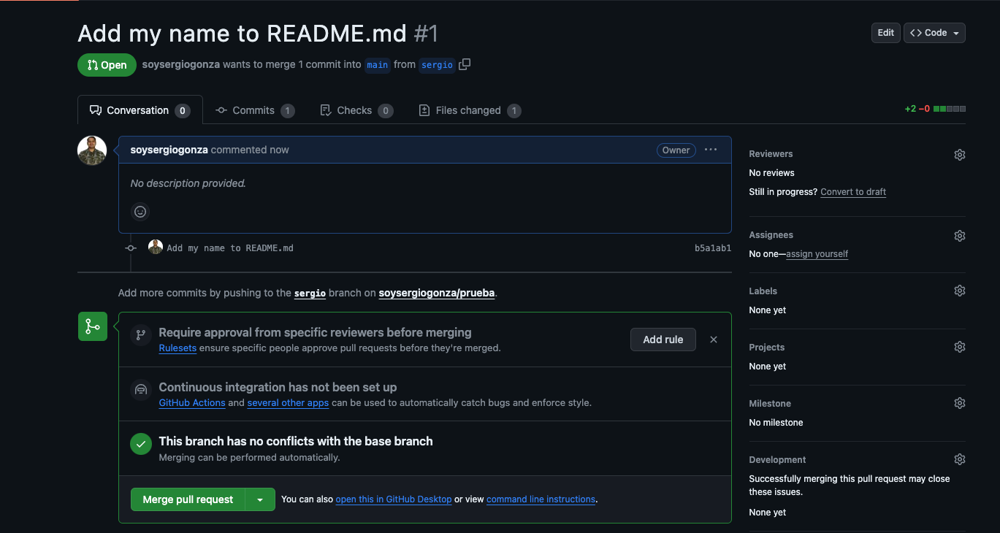

# Introducción

En artículos anteriores aprendimos como configurar Git en local, aprendimos a crear un repo en GitHub y descargarlo.
Ahora vamos a aprender a como interactúa finalmente Git con GitHub.

Cuando hacemos clone de un repo de GitHub, estamos haciendo una copia de ese repo que se encuentra en la nube, hacia
nuestro local.

En mi caso voy a descargar el repo [prueba](https://github.com/soysergiogonza/prueba) que cree en GitHub, solo
contiene un archivo `README.md`.\
Más o menos así debe lucir la terminal después clonar el repo dentro del directorio `Documents`.



Como podemos notar, después de haberse descargado el repositorio `prueba`, se creó un directorio con el mismo nombre
del repositorio. Luego navegamos al directorio usando `cd prueba`.\

Apenas estamos dentro de la carpeta `prueba`, podemos ver los archivos usando el comando `ls`. Lo cual por el momento
solo nos muestra el archivo `README.md`.



También podemos ver el contenido oculto de la carpeta usando `ls -all`.\



Aquí podemos ver que también tenemos un directorio oculto llamado `.git`, este directorio es el que nos permite
interactuar con git, pues es el que contiene toda la información y registros necesarios para que nuestro repositorio
local trabaje con Git y a su vez nos va a permitir interactuar con los repositorios remotos.

# Subir cambios a GitHub

Para poder subir cambios a GitHub, primero es necesario hacer cambios en el repositorio local de nuestro proyecto
`prueba`.\

Para ellos vamos a seguir los pasos listados a continuación:

1.  Abrir el proyecto `prueba` con nuestro editor de texto favorito.
2.  Abrir la terminal y asegurarse de estar en el directorio del proyecto `prueba`.
3.  Si estamos en el directorio `prueba` que descargamos debería aparecer el nombre de la rama en la que estamos
    trabajando; como no hemos configurado una nueva rama, entonces debería aparecer `main` por defecto.
4.  Para efectos prácticos, vamos a crear una rama en la que podamos trabajar sin afectar la rama `main`. Para ello
    vamos a usar el siguiente comando:

        ```bash
        git checkout -b TuNombre
        ```
        - El comando `git checkout -b` nos permite crear una nueva rama con el nombre que le indiques y a la vez navegar a
        esa rama.
        - En mi caso voy a crear una rama con mi nombre, por lo que el comando quedaría de la siguiente manera:
        ```bash
        git checkout -b sergio
        ```

5.  Modificar el archivo `README.md`.

    - En mi caso voy a agregar mi nombre en el archivo `README.md`.\
      

6.  Guardar los cambios en el archivo `README.md` con `Ctrl + S` o `Cmd + S`.
    - En Visual Studio Code, vas a notar un punto blanco en la parte superior derecha de la pestaña del archivo
      `README.md`. Eso indica que el archivo ha sido modificado y no ha sido guardado. Al guardar el archivo, el punto
      blanco desaparecerá, lo cual indica que no hay cambios pendientes por guardar.
7.  Abrir la terminal y asegurarse de estar en el directorio del proyecto `prueba` y en la rama que acabamos de crear.
8.  Verificar los cambios realizados en el repositorio local con el comando `git status`.
    - El comando `git status` nos muestra que archivos han sufrido cambios en el repositorio local, podríamos decir
      que nos muestra el estado del proyecto.\
      
9.  Agregar los cambios realizados al área de espera con el comando `git add README.md`.
    - El comando `git add` nos permite agregar los cambios realizados en el archivo `README.md` al área de espera.
    - Si queremos agregar todos los cambios realizados en el repositorio local al área de espera, podemos usar el
      comando `git add .`.
10. Verificar que los cambios han sido agregados al área de espera con el comando `git status`.
    - Como ya sabemos, el comando `git status` nos muestra el estado de los archivos en el repositorio local.
    - En este caso, nos muestra que el archivo `README.md` ha sido modificado, agregado al área de espera y está listo
      para ser confirmado.
      
11. Confirmar los cambios realizados con el comando `git commit -m "Mensaje del commit"`.
    - El comando `git commit -m` nos permite confirmar los cambios realizados en el repositorio local.
    - El mensaje del commit es un mensaje que nos permite identificar los cambios realizados en el repositorio local.
    - En mi caso, el comando quedaría de la siguiente manera:
    ```bash
    git commit -m "Add my name to README.md"
    ```
12. Verificar que los cambios han sido confirmados con el comando `git status`.
    - El comando `git status` nos muestra el estado de los archivos en el repositorio local.
    - En este caso, nos muestra que no hay cambios pendientes por confirmar.
      

- Cuando hacemos el commit nos muestra algunos detalles como la `rama`, `id` y el `mensaje` del commit.
  - Si hacemos de nuevo `git status` nos muestra que no hay cambios pendientes por confirmar.

13. Subir los cambios al repositorio remoto con el comando `git push origin TuNombre`.

    - El comando `git push origin` nos permite subir los cambios realizados en el repositorio local al repositorio
      remoto.
    - En mi caso, el comando quedaría de la siguiente manera:

    ```bash
    git push origin sergio
    ```

    - El comando `git push origin sergio` nos permite subir los cambios realizados en el repositorio local al
      repositorio remoto en la rama `sergio`.

14. Verificar que los cambios han llegado al repositorio remoto en GitHub.
    - Si vamos a nuestro repositorio en GitHub, vamos a notar que se ha creado una nueva rama con el nombre que le
      dimos al hacer el push.
    - En mi caso, la rama se llama `sergio`.\
      
    - Si hacemos clic en la rama `sergio`, vamos a notar que el archivo `README.md` ha sido modificado y que el cambio
      que hicimos en el repositorio local ha llegado al repositorio remoto.
    - Para completar los cambios, vamos a hacer clic en `Compare & pull request`.
    - Nos aparece un panel para controlar un poco más el estado del Pull Request que se va a realizar, podemos
      ponerle un mensaje más largo, y más abajo notar todos los cambios que se van a realizar en los diferentes
      archivos.
    - Luego hacemos clic en `Create pull request`.
      
    - Finalmente hacemos clic en `Create pull request` para confirmar el pull request.
    - Si todo ha salido bien, vamos a notar que el pull request ha sido creado y que está listo para ser revisado por
      el dueño del repositorio.
      
15. Recuerda que por el momento no vamos a hacer el merge del pull request, eso lo hará el dueño del repositorio.
